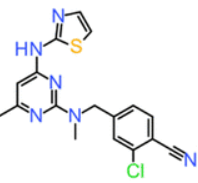

# Reverse 3D Virtual Screening Study Using ROSHAMBO2

Figure 1. Structure of Compound 31

**Compound 31** (Figure 1), a known inhibitor of the ROS1 kinase (Petrović, D. et al. 2022), was used as the query molecule in a large-scale three-dimensional (3D) virtual screening campaign against the **CHEMBL35** database. The search was conducted using **[ROSHAMBO2](https://github.com/molecularinformatics/roshambo2)**  (Atwi, R. et al. 2025), a GPU-accelerated 3D molecular similarity engine that employs shape, color, and combined descriptors to evaluate structural resemblance. The dataset of top hits was generated from a screening run utilizing the following parameters:

- `--color true`
- `--start_mode 1`
- `--optim_mode combination`
- `--max_results 10000`
- `--n_gpus 2`

The resulting hit list, stored in the file **`chembl35_conf25_hits.sdf`**, comprises the 10,000 compounds exhibiting the highest similarity scores according to ROSHAMBO2’s *combination* metric. A corresponding scoring matrix, **`chembl35_conf25_hits_score.csv`**, contains comprehensive similarity metrics for each hit, including both Roshambo-specific scores and Tversky-based similarity indices.

Specifically, the dataset includes six Tversky similarity scores:
- RefTversky_volume
- RefTversky_color
- RefTverskyCombo
- FitTversky_volume
- FitTversky_color
- FitTverskyCombo

Furthermore, the molecular database employed in this study, **`CHEMBL35_conf25.h5`**, is a ROSHAMBO2-compatible 3D conformational library derived from drug-like compounds in CHEMBL V35. Conformations were generated using [CDPKit](https://github.com/molinfo-vienna/CDPKit)’s conformational generator (confgen), with a maximum of 25 distinct conformers per molecule. The database properties are summarized as follows:

- **Molecule count (pre-preparation)**: 910,625
- **Expanded molecule count (post-preparation)**: 1,352,233 *(accounting for protonation states, tautomers, and stereoisomers)*
- **Total conformation count**: 27,798,929

This expansion reflects the complexity inherent in chemical space representation and underscores the importance of conformational sampling in accurate 3D similarity assessment.

---

## Results

The virtual screening campaign retained a final set of 10,000 top-ranking hits based on the **tanimoto_combination** score. Descriptive statistics for the four primary combination metrics are reported in **Table 1**.

### Table 1. Summary Statistics of the Four Primary Combination Similarity Scores (Top 10,000 Hits)

| Metric | tanimoto_combo_legacy | tanimoto_combination | RefTverskyCombo | FitTverskyCombo |
|-------|------------------------|------------------------|------------------|------------------|
| Count | 10,000 | 10,000 | 10,000 | 10,000 |
| Mean | 1.20614 | 0.60307 | 1.49214 | 1.52252 |
| Std | 0.05010 | 0.02505 | 0.11371 | 0.12508 |
| Min | 1.154999 | 0.577500 | 1.183000 | 1.218000 |
| 25% | 1.170987 | 0.585493 | 1.413000 | 1.434000 |
| 50% | 1.191708 | 0.595854 | 1.483000 | 1.513000 |
| 75% | 1.225248 | 0.612624 | 1.565000 | 1.599000 |
| Max | 1.567736 | 0.783868 | 1.978000 | 2.106000 |

Among the top hits, **CHEMBL1997924** was selected for detailed analysis due to its high similarity scores and known pharmacological activity. The 3D structures of both the query molecule (Compound 31) and CHEMBL1997924 are illustrated in **Figure 2**.

Figure 2. 3D Structures of Compound 31 (left) and CHEMBL1997924 (right)

### Table 2. 3D Similarity Scores for CHEMBL1997924 Relative to Compound 31

| Metric | Value |
|--------|-------|
| tanimoto_combo_legacy | 1.430 |
| tanimoto_shape | 0.794 |
| tanimoto_color | 0.636 |
| tanimoto_combination | 0.715 |
| FitTversky_volume | 0.864 |
| FitTversky_color | 0.651 |
| RefTverskyCombo | 1.873 |
| FitTverskyCombo | 1.515 |

The data in Table 2 indicate a strong structural correspondence between Compound 31 and CHEMBL1997924, particularly with respect to molecular shape (*tanimoto_shape = 0.794*), which suggests visual and shape similarity. The *RefTverskyCombo* score of **1.873** ranks CHEMBL1997924 among the top 15 hits (13th by score) in the dataset, despite its relatively lower index position (56th), confirming its prominence within the candidate pool.

Notably, CHEMBL1997924 exhibits a documented **ROS1 IC₅₀ value of 1 nM**, indicating potent and selective inhibition. This pharmacological validation provides strong evidence that the high similarity scores identified by ROSHAMBO2 correlate not only with structural resemblance but also with biologically relevant activity.

---

## Computational Performance

The entire screening process was executed on two **NVIDIA GeForce RTX 4090 GPUs** (each equipped with 24 GB GDDR6X memory), completing in approximately **12 minutes**. The average processing throughput amounted to **19,305 conformations per second per GPU**, which represents a significant performance compared to CPU-based workflows.

While this rate is lower than the benchmark value of **60,600 conformations/second (on-demand mode)** reported in recent literature (Atwi et al., 2025), it remains highly competitive given that the current execution utilized standard batch-mode GPU allocation without specialized hardware optimization. The total runtime—under a quarter-hour—demonstrates the practical feasibility of ROSHAMBO2 for high-throughput screening in drug discovery pipelines.

---

## Discussion

This study demonstrates ROSHAMBO2’s power in identifying novel **3D shape-matched inhibitors** of ROS1 kinase that closely resemble Compound 31 in molecular conformation and spatial features—despite lacking significant 2D structural resemblance ([Tanimoto similarity ≥ 0.4 in CHEMBL35](https://www.ebi.ac.uk/chembl/advanced_search/similarity/Cc1cc(Nc2nccs2)nc(N(C)Cc2ccc(C%23N)c(Cl)c2)n1/40)). Traditional fingerprint-based methods often fail to detect such relationships due to their reliance on atom connectivity and pharmacophoric patterns, whereas shape- and field-based approaches like ROSHAMBO2 are better suited for capturing subtle conformational and spatial relationships.

The identification of **CHEMBL1997924** as a top hit underscores the power of 3D conformational analysis in uncovering functionally relevant chemical matter that may be missed by 2D similarity screening. Its high *tanimoto_shape* score (0.794) and exceptional RefTverskyCombo value (1.873), coupled with its potent biological activity, validate ROSHAMBO2’s ability to prioritize candidates with both structural plausibility and target relevance.

Moreover, the integration of multiple similarity metrics—including combined shape-color descriptors and Tversky-based alignment scores—enhances the reliability and interpretability of the screening results, enabling nuanced prioritization of hits based on different aspects of molecular likeness.

The computational efficiency achieved within 12 minutes further supports ROSHAMBO2’s viability in iterative lead optimization workflows and large-scale compound screening campaigns, particularly when integrated into cloud- or cluster-based compute environments.

---

## Conclusion

This study highlights ROSHAMBO2’s ability to discover **potent, structurally distinct inhibitors** of ROS1 that exhibit high 3D shape and pharmacophoric congruence with Compound 31, yet possess no significant 2D structural analogs in CHEMBL35—underscoring the value of conformational similarity screening in uncovering novel chemical matter. The discovery of **CHEMBL1997924**, a high-affinity ROS1 inhibitor with strong shape congruence to Compound 31, highlights the advantage of leveraging conformational space representation in virtual screening.

Given its speed, scalability, and multi-descriptor scoring system, ROSHAMBO2 emerges as a valuable tool for modern drug discovery, particularly in targeting complex protein-ligand interactions that are poorly captured by conventional methods. 

---

## References

- Petrović, D. et al. (2022) “Virtual Screening in the Cloud Identifies Potent and Selective ROS1 Kinase Inhibitors,” Journal of Chemical Information and Modeling, 62(16), pp. 3832–3843. Available at: https://doi.org/10.1021/acs.jcim.2c00644.
- Atwi, R. et al. (2025) “ROSHAMBO2: Accelerating Molecular Alignment for Large Chemical Libraries with GPU Optimization and Algorithmic Advances,” Journal of Chemical Information and Modeling [Preprint]. Available at: https://doi.org/10.1021/acs.jcim.5c01322.

---

**Data Availability**: All datasets and scripts used in this study are available at: [https://github.com/gkxiao/RoshamboLearningJourney](https://github.com/gkxiao/RoshamboLearningJourney)
